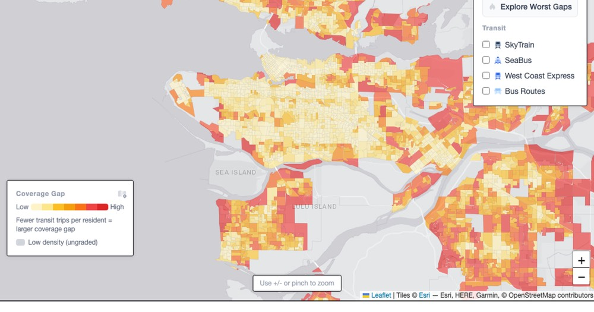

# Mind the Gap

**[mindthegap.fyi](https://mindthegap.fyi)** — an interactive map scoring every one of Metro Vancouver's 3,590 census dissemination areas by how underserved it is by transit.



## What it is

Mind the Gap combines TransLink's published schedule data with Statistics Canada's census to find neighbourhoods where a lot of people live but transit barely reaches — then lets you click into any one of them for the evidence. It's a small, self-contained geospatial product: no backend, no database, just a scoring pipeline that runs once and a map that renders the result.

- **The map** — a choropleth of every area's gap score, with toggleable transit-mode layers (bus, SkyTrain, SeaBus, West Coast Express), a population-density heatmap, and individual stop markers.
- **Gap Explorer** — the 25 most critical gaps, ranked, with one click to fly to any of them.
- **Report cards** — click any area for its letter grade, population density, and nearest stops with walking distances.
- **Scored data, open to reuse** — download the full dataset as GeoJSON (CC BY 4.0) from the FAQ.

## How the score works

For each area, count the total daily transit trips within a 600 m walking distance of its centre and divide by the resident population to get trips per capita. That figure is percentile-ranked against every other area above a density floor (400 people/km²) — fewer trips per resident means a higher gap score. Areas below the density floor are shown ungraded. The score is relative by construction: it flags the worst-served areas in this region, not an absolute standard of adequate service.

## Data pipeline

Everything the app serves is pre-computed and static — the only runtime network call is OpenStreetMap Nominatim for reverse-geocoding a clicked point. The pipeline itself is a set of one-off Node scripts, run manually against raw source data that isn't checked into this repo:

| Step | Input | Output |
|---|---|---|
| `npm run data:gtfs` | TransLink GTFS feed in `data/raw/gtfs/` | `public/data/stops.geojson`, `routes.geojson` |
| `npm run data:census` | StatsCan 2021 DA boundaries + census profile CSV in `data/raw/` | `public/data/census-das.geojson` |
| `npm run data:gaps` | The two GeoJSON outputs above | `public/data/gap-analysis.geojson` (gap scores joined in) |
| `npm run data:topojson` | The GeoJSON outputs | TopoJSON versions the app actually fetches |
| `npm run data:export` | Scored data | The public downloadable dataset in the FAQ |

The GeoJSON files from the first three steps are transient intermediates — only the final TopoJSON artifacts and the exported dataset are checked in. `npm run data` runs the whole chain in order.

Data sources: [TransLink GTFS](https://www.translink.ca/about-us/doing-business-with-translink/app-developer-resources/gtfs/gtfs-data), [Statistics Canada 2021 Census](https://www12.statcan.gc.ca/census-recensement/2021/), 2021 DA cartographic boundary files. Derived data is offered under CC BY 4.0.

## Stack

React 19 + Vite, Tailwind CSS v4, Leaflet / react-leaflet, Turf.js for geometry, PostHog for analytics, deployed on Vercel.

## Running locally

```bash
npm install
npm run dev
```

Analytics is optional — without a `.env` (see `.env.example`) PostHog simply no-ops.

To regenerate the data yourself, unzip the GTFS feed into `data/raw/gtfs/` and the StatsCan boundary + profile files into `data/raw/`, then run `npm run data`.

## How this was built

I made the product decisions — the data sources, the scoring method, what the map needed to show. [Claude Code](https://claude.com/claude-code) did the implementation, with me reviewing every change along the way.

## License

Code is [MIT](LICENSE). The derived datasets in `public/data/` are offered under [CC BY 4.0](https://creativecommons.org/licenses/by/4.0/); source data from TransLink's GTFS feed and Statistics Canada's 2021 Census remain subject to their own terms.
